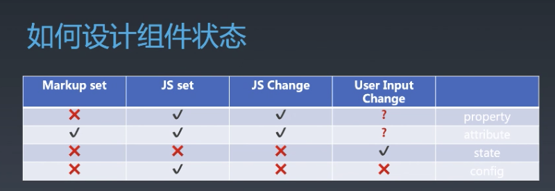

# 每周总结可以写在这里
### 对象与组件
- 对象
  - Properties
  - Methods
  - Inherit
- 组件
  - Properties
  - Methods
  - Inherit
  - Attribute
  - Config & State
  - Event
  - Lifecycle
  - Children
### Attribute vs Property
  - Attribute强调描述性
  - Property强调从属关系
  - 可以在HTML更改的都是Attribute
### 组件状态如何设计
